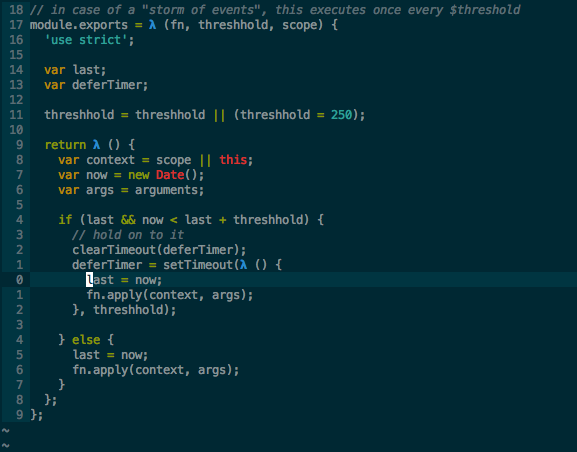

vim-lambdify
=====================

A vim plugin that conceals lambdas/inline functions with a lambda character for
various languages

Requirements
------------
Vim >= 7.3 (for the conceal feature)

Installation
------------

If you are using vundle, add this to your list of bundles::

    Bundle 'calebsmith/vim-lambdify'

Otherwise, copy the /after/syntax files into ~/.vim/after/syntax and
/autoload/vimlambdify.vim into ~/.vim/autoload

Overview
--------

Vim's conceal feature allows for some text to be replaced with something else
for display purposes, without changing the underlying representation of what
is saved into the file. Plugins such as vim-haskellConceal and vim-cute-python
use this to replace many different things with more pithy/mathy symbols. The
approach taken here is to replace *only* lambdas, but to do so for many
different languages to avoid having to use many plugins for a single feature.

Additionally, some plugins lose syntax highlighting for concealed characters.
vim-lambdify makes efforts to ensure highlighting is kept.

At the moment, the following languages have lambda conceal support through
vim-lambdify:

- Python
- Ruby
- JavaScript
- Scheme
- Erlang

More will likely be added over time. These just happen to be languages I use
frequently that have lambdas or something akin to them.

Acknowledgements
----------------
Many thanks for the ideas and some implementation details taken from the
following plugins:

- Twinside/vim-haskellConceal
- ehamberg/vim-cute-python
- dkinzer/vim-schemer
- tyok/js-mask
